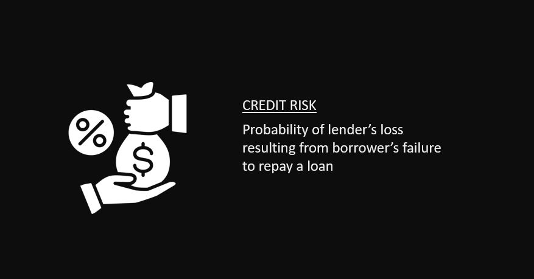

# Credit Risk Modeling in Python

## Exploratory data analysis on credit data and risk modeling  
### [Python](https://github.com/s1dewalker/Credit-Risk-Modeling-in-Python/blob/main/credit_risk_modeling.ipynb) : EDA + Risk Modeling  
### [SQL](https://github.com/s1dewalker/Credit-Risk-Modeling-in-Python/blob/main/SQLQuery_cr_loan2.sql) : EDA  
 

## Analysing the 5 Cs of credit

- Character
- Capacity
- Capital
- Collateral
- Conditions 

