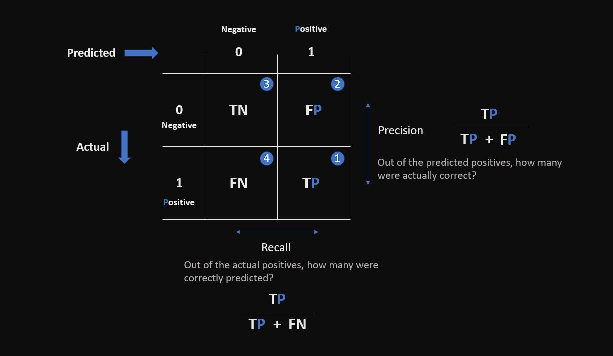

# Credit Risk Modeling in Python

## Exploratory data analysis (EDA) on credit data and credit risk modeling  
### [Python](https://github.com/s1dewalker/Credit-Risk-Modeling-in-Python/blob/main/credit_risk_modeling-2.ipynb) : EDA + Credit Risk Modeling + Model Validation + Tuning 
### [SQL](https://github.com/s1dewalker/Credit-Risk-Modeling-in-Python/blob/main/SQLQuery_cr_loan2.sql) : EDA + Data Cleaning 
 

**EDA**: Exploring the data, `drop_duplicates`, finding anomalies or outliers, handling missing values with `fillna()` or `dropna()`, using `crosstab` for pivot tables.  

**Risk Modeling**: Using `RandomForestClassifier` with error metrics like recall, F1-score. Dealing with Underfitting (high training error) and overfitting (testing error >> training error). Validating models with cross validation methods. 

## Analysing the 5 Cs of credit

- Character - borrower's credit history / creditworthiness, customer segmentation, demographics, card type, usage
- Capacity - income (history of stable income)
- Capital - savings, invvestments
- Collateral - loan, tenure
- Conditions - purpose of credit, economy, employment type
 

## Error metrics  

Confusion matrix:

For credit card data, recall is the most important, since we want to minimize false negatives (FN).  
Meaning, the actual frauds that were not predicted correctly.  

